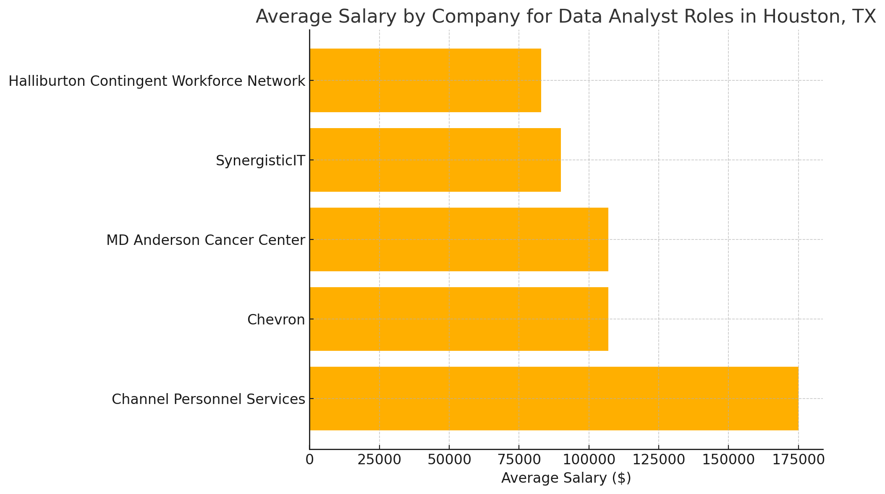

# Inroduction
This project analyzes the data job market with a focus on Data Analyst roles. 

It explores:

💸 Top-paying job titles

🔥 High-demand skills

🎯 Optimal skills worth learning for aspiring data professionals

The goal is to uncover valuable insights and trends that can guide career development in data analytics.

SQL Queries Here:
[Project Folder](/project)
# Background
With the rapid growth of data-driven decision-making, the demand for skilled Data Analysts continues to rise. Understanding which skills are most valued and which job roles offer the highest compensation can help aspiring analysts make informed learning and career choices.

This project uses real-world job data sourced from the SQL for Data Analysis course by Luke Barousse [SQL Course](https://lukebarousse.com/sql). The dataset includes job titles, required skills, and salary information, enabling a deep dive into:

🔍 The top-paying data roles

📈 The most in-demand skills

🎓 The most valuable skills to learn for career growth

# Tools Used
* **SQL** – Primary language for querying and analyzing data
* **PostgreSQL** – Database management system used to store and access data
* **Visual Studio Code** – Integrated development environment (IDE) for writing SQL queries
* **Git & GitHub** – Version control tools for tracking changes and collaboration

# The Analysis
### 1. Top Paying Data Analyst Jobs in Houston
To identify the highest paying Data Analyst jobs in Houston, TX, I filtered the data analyst postions by average yearly salary and location.

```sql
SELECT
    job_id,
    job_title_short,
    job_title,
    job_location,
    job_schedule_type,
    salary_year_avg,
    job_posted_date,
    name AS company_name
FROM
    job_postings_fact
LEFT JOIN
    company_dim
ON  job_postings_fact.company_id = company_dim.company_id
WHERE 
    job_title_short = 'Data Analyst' 
    AND
    job_location LIKE '%Houston%'
    AND
    salary_year_avg IS NOT NULL
ORDER BY salary_year_avg DESC
LIMIT 5
```

**Quick Insights**: Data Analyst Jobs in Houston, TX (2023)

* Salary Range: 82K–82K–175K (Avg: ~$112K)

* Top Pay: $175K (Instrumentation Engineer)

* Industries: Energy (Chevron, Halliburton), Healthcare (MD Anderson), IT Staffing

* Job Types: All Full-time, On-Site

* Posting Peak: Q3–Q4 2023

Key Takeaway: Salaries vary by role—engineering & research pay highest (
100K+), while ITstaffing offers lower(80K-90K)


Here’s the bar chart showing the average salary by company for Data Analyst roles in Houston, TX! (Generated from ChatGPT)


### 2. Skills Required for Top Paying Data Analyst Jobs in Houston
To understand what skills are demanded for the highest-paying Data Analyst roles in Houston, TX, I analyzed the top 5 roles identified earlier and matched them with their listed skills.

```sql
WITH top_pay_jobs AS (
    SELECT
        job_id,
        job_title_short,
        job_title,
        salary_year_avg,
        name AS company_name
    FROM
        job_postings_fact
    LEFT JOIN
        company_dim
    ON  job_postings_fact.company_id = company_dim.company_id
    WHERE 
        job_title_short = 'Data Analyst' 
        AND
        job_location LIKE '%Houston%'
        AND
        salary_year_avg IS NOT NULL
    ORDER BY salary_year_avg DESC
    LIMIT 5
)

SELECT 
    tpj.*,
    sd.skills
FROM 
    top_pay_jobs AS tpj 
INNER JOIN 
    skills_job_dim AS sjd 
ON  tpj.job_id = sjd.job_id
INNER JOIN
    skills_dim AS sd
ON  sjd.skill_id = sd.skill_id
ORDER BY salary_year_avg DESC

```
**Top Skills by Frequency**:

🥇 Python (Most Required – listed in every top role)

🥈 Azure, TensorFlow, SQL, AWS, Tableau also frequently appear

🧠 ML Skills: TensorFlow, PyTorch, Scikit-learn are common for research/engineering roles

🛠️ Cloud & Big Data Tools: Azure, AWS, Databricks, Snowflake, Spark especially for Big Data Analyst roles

🎨 Visualization Tools: Tableau, Plotly

💻 Programming Languages: Python, SQL, Java, R, JavaScript

Key Takeaway:
If you're targeting a six-figure Data Analyst role in Houston, focus on Python, Cloud skills (Azure/AWS), and ML frameworks like TensorFlow. Also, SQL + Tableau remain crucial foundational skills.

Here’s the Skills Frequency Bar Chart based on the top-paying Data Analyst jobs in Houston!
You can clearly see how Python, Azure, TensorFlow, and SQL dominate the requirements. (Generated from ChatGPT)


### 3. Most In-Demand Skills for Data Analysts
To find out the most in-demand skills across all Data Analyst job postings (not just the top-paying ones), I analyzed the frequency of skills appearing in job descriptions.

```sql
SELECT 
    sd.skills,
    COUNT(*) AS skill_count
FROM 
    job_postings_fact AS jpf  
INNER JOIN 
    skills_job_dim AS sjd 
ON  jpf.job_id = sjd.job_id
INNER JOIN
    skills_dim AS sd
ON  sjd.skill_id = sd.skill_id
WHERE 
    jpf.job_title_short = 'Data Analyst'
GROUP BY 
    sd.skill_id
ORDER BY 
    skill_count DESC
LIMIT 5
```
**Quick Insights**: Top 5 In-Demand Data Analyst Skills (2023)

| Skill    | # of Job Postings |
|----------|-------------------|
| SQL      | 92,628             |
| Excel    | 67,031             |
| Python   | 57,326             |
| Tableau  | 46,554             |
| Power BI | 39,468             |

Trends:

🥇 SQL remains the undisputed king for Data Analysts — essential for querying and managing databases.

🥈 Excel is still heavily used across industries for data manipulation and reporting.

🥉 Python is growing rapidly, especially where automation, data wrangling, or machine learning is involved.

📊 Visualization Tools like Tableau and Power BI are critical for translating insights into dashboards and reports.

Key Takeaway:
If you're entering the Data Analyst field, mastering SQL, Excel, Python, Tableau, and Power BI will make you highly competitive for most roles in the market.


### 4. Top Skills Based on Salary for Data Analysts
To find out which skills are most financially rewarding for Data Analysts, I analyzed the average salaries associated with each skill across all postings with specified salary data.
```sql
SELECT 
    sd.skills,
    ROUND(AVG(jpf.salary_year_avg), 0) AS average_year_salary
FROM 
    job_postings_fact AS jpf  
INNER JOIN 
    skills_job_dim AS sjd 
ON  jpf.job_id = sjd.job_id
INNER JOIN
    skills_dim AS sd
ON  sjd.skill_id = sd.skill_id
WHERE 
    jpf.job_title_short = 'Data Analyst'
    AND
    jpf.salary_year_avg IS NOT NULL
GROUP BY 
    sd.skills
ORDER BY
    average_year_salary DESC
LIMIT 20
```

**Quick Insights**: Top 20 Highest-Paying Skills for Data Analysts (2023)

| Skill         | Average Yearly Salary ($) |
|---------------|----------------------------|
| SVN           | 400,000                    |
| Solidity      | 179,000                    |
| Couchbase     | 160,515                    |
| DataRobot     | 155,486                    |
| GoLang        | 155,000                    |
| MXNet         | 149,000                    |
| dplyr         | 147,633                    |
| VMware        | 147,500                    |
| Terraform     | 146,734                    |
| Twilio        | 138,500                    |
| GitLab        | 134,126                    |
| Kafka         | 129,999                    |
| Puppet        | 129,820                    |
| Keras         | 127,013                    |
| PyTorch       | 125,226                    |
| Perl          | 124,686                    |
| Ansible       | 124,370                    |
| Hugging Face  | 123,950                    |
| TensorFlow    | 120,647                    |
| Cassandra     | 118,407                    |

Trends:

🏆 SVN (Version Control System) surprisingly tops the list, though likely due to niche roles with very high salaries.

💰 Blockchain Skills: Solidity (Ethereum smart contracts) fetches huge premiums.

🤖 AI/ML Libraries: TensorFlow, PyTorch, Keras, and Hugging Face skills correlate strongly with high salaries.

☁️ Cloud and Infrastructure: Terraform, Ansible, VMware, Kafka are associated with very lucrative Data Analyst+DevOps crossover roles.

Key Takeaway:
Machine Learning, Cloud Infrastructure, and Blockchain/Big Data technologies are huge boosters for Data Analyst salaries.
Developing expertise in these areas can significantly increase earning potential beyond traditional analysis skills.


### 5. Most Optimal Skills to Learn for Data Analysts
To strategically guide skill development, I identified skills that are both in high demand and associated with high salaries across Data Analyst job postings with specified salaries.

```sql
WITH skills_demand AS(
    SELECT 
        sd.skill_id,
        sd.skills,
        COUNT(*) AS skill_count
    FROM 
        job_postings_fact AS jpf  
    INNER JOIN 
        skills_job_dim AS sjd 
    ON  jpf.job_id = sjd.job_id
    INNER JOIN
        skills_dim AS sd
    ON  sjd.skill_id = sd.skill_id
    WHERE 
        jpf.job_title_short = 'Data Analyst'
        AND
        jpf.salary_year_avg IS NOT NULL
    GROUP BY 
        sd.skill_id
),
average_salary AS(
    SELECT 
        sd.skill_id,
        sd.skills,
        ROUND(AVG(jpf.salary_year_avg), 0) AS average_year_salary
    FROM 
        job_postings_fact AS jpf  
    INNER JOIN 
        skills_job_dim AS sjd 
    ON  jpf.job_id = sjd.job_id
    INNER JOIN
        skills_dim AS sd
    ON  sjd.skill_id = sd.skill_id
    WHERE 
        jpf.job_title_short = 'Data Analyst'
        AND
        jpf.salary_year_avg IS NOT NULL
    GROUP BY 
        sd.skill_id
)

SELECT 
    skills_demand.skill_id,
    skills_demand.skills,
    skill_count,
    average_year_salary
FROM
    skills_demand
INNER JOIN
    average_salary
ON  skills_demand.skill_id = average_salary.skill_id
ORDER BY
    skill_count DESC, 
    average_year_salary DESC
LIMIT 20
```

**Quick Insights**: Most Strategic Skills for Data Analysts (2023)

| Skill        | # of Job Postings | Average Yearly Salary ($) |
|--------------|-------------------|---------------------------|
| SQL          | 3,083             | 96,435                   |
| Excel        | 2,143             | 86,419                   |
| Python       | 1,840             | 101,512                  |
| Tableau      | 1,659             | 97,978                   |
| R            | 1,073             | 98,708                   |
| Power BI     | 1,044             | 92,324                   |
| Word         | 527               | 82,941                   |
| PowerPoint   | 524               | 88,316                   |
| SAS          | 500               | 93,707                   |
| SQL Server   | 336               | 96,191                   |
| Oracle       | 332               | 100,964                  |
| Azure        | 319               | 105,400                  |
| AWS          | 291               | 106,440                  |
| Go           | 288               | 97,267                   |
| Flow         | 271               | 98,020                   |
| Looker       | 260               | 103,855                  |
| Snowflake    | 241               | 111,578                  |
| SPSS         | 212               | 85,293                   |
| Spark        | 187               | 113,002                  |

Trends:

🥇 SQL, Excel, Python, Tableau, R are top skills by job demand volume.

💰 Python, Oracle, Azure, AWS, Looker, Snowflake, and Spark are very high salary boosters.

🌟 Snowflake and Spark offer the highest average salaries among popular skills (~$110K+).

📈 Cloud and Big Data Tools (AWS, Azure, Spark, Snowflake) are becoming essential for top salaries.

Key Takeaway:
To maximize both job opportunities and salary, focus on mastering SQL, Python, Tableau, and Power BI — but pair them with Cloud (AWS/Azure) and Big Data technologies (Snowflake, Spark) for optimal career growth.

# What I Learned
Through this project, I significantly strengthened my skills in the following tools and technologies:

**SQL**:
I enhanced my ability to write complex SQL queries, including JOIN, CTE, and aggregation operations, to extract meaningful insights from relational databases.

**PostgreSQL**:
I gained practical experience working with PostgreSQL as the database engine, learning how to execute queries efficiently and manage large datasets.

**Visual Studio Code**:
I practiced writing and organizing SQL scripts in VS Code, improving my workflow and code management with extensions and syntax highlighting.

**Git & GitHub**:
I applied version control principles by using Git for tracking changes and GitHub for project documentation and collaboration readiness.

**Data Analysis Techniques**:
I learned how to structure data-driven questions, build modular queries, and present insights clearly, which mirrors real-world analytical problem-solving.

**Markdown Documentation**:
I improved my ability to document technical projects using Markdown, preparing a professional-style README file for project presentation.

# Conclusion
This project provided a comprehensive exploration of the Data Analyst job market, focusing on the skills and tools that are most valued by employers today.

Through real-world job data, I identified:

* The top-paying job roles and skills for Data Analysts in Houston

* The most in-demand skills across all job postings

* The skills associated with the highest salaries

* The optimal combination of skills that balance demand and earning potential


Key Takeaways:

* SQL, Excel, Python, Tableau, and Power BI form the core skill set for Data Analysts.

* Cloud platforms (AWS, Azure) and Big Data tools (Spark, Snowflake) are critical for boosting salaries into six figures.

* Combining foundational skills with specialized tools opens up broader and more lucrative career opportunities.
